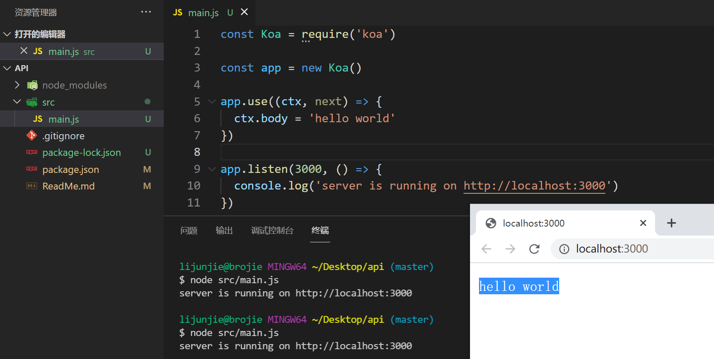
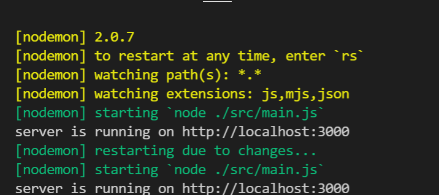

# koa2教程

## 1.项目初始化

生成`package.json`文件: 记录项目的依赖

```js
npm init -y 
```

安装koa框架

```js
npm install koa
```

## 2.项目基本架构

编写最基本的的app，创建 `src/main.js`。

```js
const Koa = require('koa')

const app = new Koa()

app.use((ctx, next) => {
  ctx.body = 'hello world'
})

app.listen(3000, () => {
  console.log('server is running on http://localhost:3000')
})
```



## 3.项目的基本优化

### 3.1 安装 nodemon 工具 ( node服务热更新 )

```js
npm i nodemon -D
```

编写`package.json`脚本

```json
"scripts": {
  "serve": "nodemon ./src/main.js",
  "test": "echo \"Error: no test specified\" && exit 1"
},
```

执行`npm run serve`启动服务



### 3.2 读取配置文件

安装`dotenv`, 读取根目录中的`.env`文件, 将配置写到`process.env`中

```js
npm i dotenv
```

创建`.env`文件

```js
APP_PORT=8000
```

创建`src/config/config.default.js`

```js
const dotenv = require('dotenv')
dotenv.config()

// console.log(process.env.APP_PORT)

module.exports = process.env
```

改写`main.js`

```js
const Koa = require('koa')

const { APP_PORT } = require('./config/config.default')

const app = new Koa()

app.use((ctx, next) => {
  ctx.body = 'hello api'
})

app.listen(APP_PORT, () => {
  console.log(`server is running on http://localhost:${APP_PORT}`)
})
```

## 4. 添加路由

路由: 根据不同的 URL, 调用对应处理函数

### 4.1 安装 koa-router

```js
npm i koa-router
```

步骤:

1. 导入包
2. 实例化对象
3. 编写路由
4. 注册中间件

### 4.2 编写路由

创建`src/router`目录, 编写`user.route.js`

```js
const Router = require('koa-router')

const router = new Router({ prefix: '/users' })

// GET /users/
router.get('/', (ctx, next) => {
  ctx.body = 'hello users'
})

module.exports = router
```

### 4.3 改写 main.js

```js
const Koa = require('koa')

const { APP_PORT } = require('./config/config.default')

const userRouter = require('./router/user.route')

const app = new Koa()

app.use(userRouter.routes())

app.listen(APP_PORT, () => {
  console.log(`server is running on http://localhost:${APP_PORT}`)
})
```


